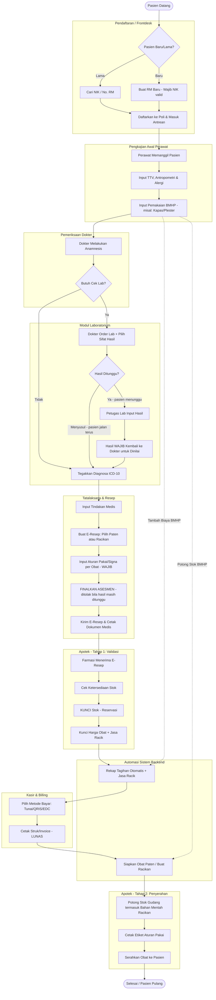

# Dokumen Rujukan Pembuatan Sistem (System Reference Document)

**Sistem:** Sistem Informasi Klinik (SIM Klinik)  
**Klien/Instansi:** KLINIK PRATAMA SAHABAT GAMMA  
**Versi:** 2.8 (FINAL MASTER DOCUMENT)  
**Tanggal Pemutakhiran:** 18 Agustus 2026  
*(Catatan: Versi 2.8 menambahkan **Penjamin & Klaim** (BPJS/asuransi/perusahaan, tarif kontrak, klaim kolektif, piutang), **Kepatuhan** (persetujuan pasien & insiden keselamatan pasien), dan **Pelaporan Wajib** (SIPNAP, LB1). Ditambahkan pula *rumah* BPJS — struktur data tanpa integrasi. Lihat §4, §7, dan §8.*
*Versi 2.7 membuat laboratorium **asinkron** dan menambahkan **validasi dokter**
sebelum pasien diteruskan ke farmasi. Setiap order lab kini bersifat **Ditunggu** atau
**Menyusul**; hasil yang ditunggu selalu kembali ke dokter untuk dinilai, dan asesmen tidak
bisa difinalkan selama masih ada hasil yang ditunggu. Ditambahkan pula: pembatalan kunjungan,
pembatalan pembayaran, pembatalan order lab, pemeriksaan Atas Permintaan Sendiri (APS), dan
kunjungan berulang dalam satu hari. Lihat §3.1, §3.2, dan §4.*
*Versi 2.6 mengubah alur pembayaran — pasien **membayar sebelum menerima obat**, dan kunjungan berakhir di **farmasi**, bukan di kasir. Farmasi kini dua tahap: validasi/kunci stok, lalu penyerahan setelah lunas. Lihat §3.1 dan §4.*
*Versi 2.5 memuat spesifikasi teknologi (Tech Stack) wajib Next.js/React, Tailwind CSS, MySQL, serta rekomendasi library pendukung.)*

---

## 1. Pendahuluan
### 1.1 Tujuan Dokumen
Dokumen ini berfungsi sebagai rujukan utama (*blueprint*) dalam proses perancangan, pengembangan, dan pengujian Sistem Informasi Klinik (SIM Klinik) terintegrasi. Dokumen ini mendefinisikan arsitektur, kebutuhan fungsional (fitur), dan kebutuhan non-fungsional (teknis) secara menyeluruh agar tidak terjadi miskomunikasi antara pemangku kepentingan dan tim pengembang (vendor IT).

### 1.2 Ruang Lingkup
Platform manajemen klinik berbasis web yang memungkinkan pengelolaan operasional harian **Multi-Cabang (Multi-Site)**. Ruang lingkup mencakup: pengaturan cabang, manajemen HR dasar, pendaftaran, RME, laboratorium, apotek (termasuk obat racikan), dan kasir dengan pemisahan tugas (*segregation of duties*) yang ketat.

### 1.3 Spesifikasi Teknologi (Tech Stack) Wajib
Untuk memastikan performa, keamanan, dan skalabilitas sistem (terutama untuk persiapan integrasi API SatuSehat dan Payment Gateway), pengembang **diwajibkan** menggunakan tumpukan teknologi berikut:

*   **Frontend Framework:** `Next.js` (berbasis React). Disarankan menggunakan arsitektur *App Router* untuk performa *Server-Side Rendering* (SSR) yang optimal.
*   **Styling & UI:** `Tailwind CSS`. Untuk memastikan antarmuka yang modern, responsif, dan konsisten di seluruh modul.
*   **Database:** `MySQL`. Database relasional yang solid untuk menangani transaksi medis, rekam medis, dan keuangan.
*   **Sistem Notifikasi:** Komponen *Toast* (misal: `react-hot-toast` atau `react-toastify`) untuk memberikan umpan balik non-intrusif kepada pengguna (misal: "Resep Berhasil Disimpan" atau "Stok Obat Tidak Cukup").

**Rekomendasi Library/Plugin Pendukung (React Ecosystem):**
*   **Manajemen Form & Validasi:** `react-hook-form` dikombinasikan dengan `zod`. Sangat krusial untuk form Rekam Medis (RME) agar memastikan data seperti NIK, ICD-10, dan Aturan Pakai tervalidasi dengan ketat tanpa membebani performa aplikasi.
*   **State Management:** `Zustand` atau `Redux Toolkit` (RTK) untuk mengelola *state* yang kompleks, seperti keranjang tagihan di Kasir atau daftar komposisi di Obat Racikan.
*   **Data Fetching:** `SWR` atau `React Query` (TanStack Query) untuk sinkronisasi data *real-time* dan *caching*, berguna untuk memonitor antrean pasien dan stok apotek.
*   **Fungsi Cetak Dokumen:** `react-to-print` untuk mempermudah pencetakan tiket antrean, e-resep, struk kasir thermal, dan etiket/label aturan pakai obat.
*   **Tabel & Data Grid:** `TanStack Table` (React Table) untuk menampilkan data pasien, riwayat kunjungan, dan laporan keuangan dengan fitur *sort*, *filter*, dan *pagination* yang cepat.

---

## 2. Deskripsi Umum Sistem
### 2.1 Konteks Sistem dan Aktor (Role-Based Access Control / RBAC)
Sistem ini memberlakukan pemisahan hak akses yang ketat (*strict segregation of duties*). Tidak ada peran ganda dalam satu akun operasional.

1. **Super Admin (Tingkat Pusat / IT):** Murni teknis dan *setup* awal. Mendaftarkan cabang baru, Role, Akun Staf/Dokter, dan Master Data Global.
2. **Admin Cabang / Manajer Operasional / HR:** Mengelola operasional harian. Mengatur Jadwal Praktik Dokter, menyetujui pengajuan cuti/izin, menetapkan Dokter Pengganti, dan melihat laporan performa cabang.
3. **Dokter:** Memiliki wewenang klinis penuh. Mengakses rekam medis pasien, melakukan asesmen (SOAP), menginstruksikan order lab, dan meresepkan obat **(Paten maupun Racikan) beserta Aturan Pakai yang wajib diisi per item obat**.
4. **Perawat:** *Eksklusif* hanya memiliki akses ke modul Antrean dan Pengkajian Awal. Bertugas melakukan triase, memanggil pasien, menginput Tanda-Tanda Vital (TTV), keluhan awal, serta mencatat pemakaian Bahan Medis Habis Pakai (BMHP) saat pemeriksaan awal.
5. **Petugas Laboratorium:** *Eksklusif* hanya memiliki akses ke Modul Lab. Menerima order lab dari dokter, menginput angka hasil, dan mencetak dokumen hasil lab.
6. **Petugas Farmasi / Apotek:** *Eksklusif* mengelola Modul Inventori dan Resep. Melakukan *inbound*, *stock opname*, dan memvalidasi E-Resep. Bertugas membuat racikan sesuai instruksi, mencetak etiket (label aturan pakai), dan memotong stok bahan mentah racikan.
7. **Kasir / Billing:** *Eksklusif* hanya memiliki akses ke Modul Pembayaran. Memvalidasi tagihan akhir (termasuk penambahan biaya Jasa Racik), mencatat metode pembayaran, dan mencetak struk. Detail diagnosa klinis disembunyikan di layar kasir.

---

## 3. Alur Proses Bisnis (Business Process & Flowcharts)

### 3.1 Flowchart Pelayanan Pasien (Patient Journey)


> **Catatan alur (v2.6):** pasien **membayar sebelum menerima obat**, dan
> kunjungan berakhir di **farmasi**, bukan di kasir.
>
> Farmasi karena itu disentuh **dua kali**. Tahap pertama tidak memotong stok
> sama sekali — hanya menguncinya (*reservasi*) dan memfinalkan harga. Stok
> baru benar-benar berkurang pada tahap kedua, setelah tagihan lunas.
>
> Reservasi bukan hiasan: tanpanya, stok yang sudah ditagihkan bisa habis
> terpakai resep berikutnya sementara pasien masih mengantre di kasir — dan
> uang yang sudah diterima harus dikembalikan.
>
> Kunjungan **tanpa resep** tetap berakhir di kasir seperti biasa.

> **Catatan alur (v2.7) — laboratorium asinkron & validasi dokter.**
>
> Setiap order lab wajib menyatakan **sifat hasilnya**, dan dokterlah yang
> memilih saat memesan:
>
> | Sifat | Perilaku |
> |---|---|
> | **Ditunggu** | Pasien tertahan di klinik. Asesmen **tidak bisa difinalkan** dan farmasi **tidak boleh mengunci resep** sampai hasilnya keluar. Hasil yang keluar **selalu kembali ke dokter** untuk dinilai — termasuk bila asesmennya sudah terlanjur final. |
> | **Menyusul** | Pasien lanjut ke farmasi/kasir sekarang. Hasil masuk kapan pun tanpa menghidupkan kembali kunjungan yang sudah tutup; dokter tetap dinotifikasi. |
>
> Pembedaan ini ada karena dua kebutuhan yang sama-sama benar saling
> meniadakan tanpanya: menahan semua pasien berarti kultur resistensi lima
> hari menghentikan pelayanan, sedangkan tidak menahan siapa pun berarti
> dokter tidak pernah membaca hasil yang ia pesan sendiri.
>
> **Tombol kirim ke farmasi adalah “Finalkan Asesmen”** — tidak ada tombol
> tersendiri. Yang ditambahkan hanya penjaganya.

### 3.2 Jalur Mundur (Pembatalan)
Setiap pembatalan hanya boleh turun **satu langkah**, dan tiap turunan adalah
kebalikan persis dari naiknya. Satu operasi yang membatalkan dua langkah
sekaligus adalah cara paling mudah meninggalkan setengah keadaan yang tidak
konsisten.

| Keadaan | Aksi | Oleh | Hasil |
|---|---|---|---|
| `diterima_farmasi` | Kembalikan ke Dokter | Farmasi | Resep kembali ke dokter untuk direvisi |
| `disiapkan` (belum lunas) | Batalkan Validasi | Farmasi | Kunci stok dilepas, biaya keluar dari tagihan, kembali ke `diterima_farmasi` |
| `lunas` (obat belum diserahkan) | Batalkan Pembayaran | Kasir | Tagihan kembali ke `menunggu`; **ditolak** bila obat sudah diserahkan atau shift sudah ditutup |
| Order lab berjalan | Batalkan Order | Dokter / Petugas Lab | Tarif keluar dari tagihan, dokter dinotifikasi; **ditolak** bila hasil sudah diinput |
| Kunjungan belum lunas | Batalkan Kunjungan | Pendaftaran | Resep & order lab dibatalkan, kunci stok dilepas, antrean ditutup |

Yang sudah benar-benar terjadi di dunia nyata tidak bisa dianggap tidak
terjadi: **obat yang sudah diserahkan** hanya bisa dikoreksi lewat retur, dan
**kas shift yang sudah ditutup** lewat koreksi terpisah.

### 3.3 Kunjungan Tertunda
Worklist Dokter, Perawat, dan Pendaftaran menyaring **hari ini**. Kunjungan
yang tidak tuntas dalam sehari karena itu perlu penanganan tersendiri —
tanpanya ia hilang dari seluruh layar sementara statusnya tetap dianggap
sedang dilayani, dan **resep yang sudah divalidasi terus mengunci stok**.

1. **Terlihat.** Bagian "Tertunda dari Hari Sebelumnya" pada layar Dokter,
   Perawat, dan Pendaftaran — dipisah dari antrean hari ini karena nomor
   antrean di-reset harian.
2. **Terjangkau.** Daftar di Pendaftaran memakai tabel yang sama dengan
   tombol Batalkan, sehingga kunjungan beku punya jalan keluar.
3. **Diingatkan.** Sapuan harian mengirim satu notifikasi per cabang ke
   Admin Cabang:

   ```
   npm run sapu:tertunda            # kirim notifikasi
   npm run sapu:tertunda -- --lihat # lihat saja
   ```

   Jadwalkan lewat Task Scheduler tiap pagi sebelum klinik buka. Aman
   diulang — cabang yang sudah diberi tahu hari ini dilewati.

---

## 4. Kebutuhan Fungsional Utama
| Modul | Deskripsi Fitur | Keterangan Tambahan |
|---|---|---|
| **Pendaftaran** | Manajemen Pasien, Antrean & **Pembatalan Kunjungan** | Form wajib memuat NIK (Syarat SatuSehat).<br>Pasien **boleh datang lebih dari sekali sehari** — yang dilarang hanya berada di antrean poli yang sama dua kali sekaligus.<br>Pembatalan kunjungan melepas kunci stok resep dan membatalkan order lab yang berjalan. |
| **Klinis (Perawat)**| Triase, TTV, dan Input BMHP | Dilengkapi fitur *autocomplete* untuk BMHP (otomatis potong stok dan masuk billing). |
| **Klinis (Dokter)** | RME & Modul E-Resep | 1. Integrasi ICD-10.<br>2. **Mendukung Obat Paten dan Obat Racikan**.<br>3. **Field 'Aturan Pakai' wajib diisi** untuk setiap obat/racikan.<br>4. **Finalisasi ditolak** selama masih ada hasil lab yang ditunggu — asesmen yang menunggu hasil bukan asesmen yang lengkap. |
| **Laboratorium** | Input Hasil, **Pembatalan Order**, dan **Order APS** | Layar eksklusif Petugas Lab tanpa akses ubah RM.<br>1. Order bersifat **Ditunggu** atau **Menyusul** (§3.1).<br>2. Petugas lab bisa **membatalkan order** (sampel lisis, pasien menolak) — dokter pemesan otomatis dinotifikasi beserta alasannya.<br>3. **Atas Permintaan Sendiri (APS):** pemeriksaan yang diminta pasien tanpa instruksi dokter dibuat sebagai **order tersendiri** atas nama petugas lab — rekam medis tidak boleh menunjukkan dokter memesan sesuatu yang tidak pernah ia pesan. |
| **Apotek/Farmasi**| Manajemen Stok & Resep — **2 tahap** | 1. **Validasi:** cek stok, kunci stok (reservasi), finalkan harga & jasa racik. Stok BELUM dipotong.<br>2. **Penyerahan:** hanya setelah tagihan lunas — potong stok termasuk bahan mentah racikan, cetak etiket, tutup kunjungan. |
| **Kasir & Billing** | Sistem Tagihan Terpusat & **Pembatalan Pembayaran** | Otomatis menghitung biaya konsultasi, tindakan, lab, obat, BMHP perawat, dan **Biaya Jasa Racik Apoteker**. Kasir **bukan** ujung alur bila ada resep — pasien diteruskan ke farmasi untuk mengambil obat.<br>Pembayaran yang salah dapat dibatalkan (§3.2): tagihan kembali ke antrean, **bukan** ditandai batal — satu kunjungan hanya punya satu tagihan, sehingga `batal` bersifat final. |
| **Manajemen HR** | Jadwal & Absensi | Fitur *Assign* Dokter Pengganti. |
| **Penjamin & Klaim** | Master Penjamin, Tarif Kontrak, Klaim Kolektif, Piutang | 1. Penjamin (BPJS/asuransi/perusahaan) bersifat **global**; klaimnya per cabang.<br>2. **Tarif kontrak menimpa** tarif cabang & global — dihitung ulang di server, tidak pernah dari kiriman formulir.<br>3. `plafon_per_kunjungan` membagi tagihan: penjamin sampai plafon, selisihnya ke pasien di kasir.<br>4. Klaim: `draft → diajukan → disetujui → lunas`, boleh dibayar bertahap. Pembatalan **melepas** tagihannya untuk diklaim ulang.<br>5. Piutang **tidak ditabelkan** — diturunkan dari klaim dikurangi pembayarannya. |
| **Kepatuhan** | Persetujuan Pasien, Insiden Keselamatan (IKP) | 1. `consents` menyimpan kalimat persetujuan **utuh**, bukan rujukan templat.<br>2. Persetujuan tindakan wajib menyebut tindakan & pemberi penjelasannya.<br>3. IKP boleh dilaporkan **setiap peran operasional**, termasuk anonim; grading & RCA wewenang Admin Cabang.<br>4. Insiden kuning/merah **tidak bisa ditutup** tanpa analisis akar masalah. |
| **Pelaporan Wajib** | SIPNAP, LB1 | Keduanya **tidak menyimpan angka baru**: SIPNAP dihitung dari `stock_movements`, LB1 dari diagnosa ICD-10 yang sudah ada. Yang ditambahkan hanya penggolongan (`is_psikotropika`, `golongan_narkotika`, `no_izin_edar`) dan bentuk keluarannya. |

---

## 5. Kebutuhan Output Cetak (Kop Surat Otomatis)
Semua cetakan otomatis menarik data `sites` (Logo, Alamat, Izin Klinik) untuk Kop Surat.
1. Kertas Thermal (58/80mm): Tiket Antrean, Copy Resep, Struk Kasir.
2. Kertas A4/A5: Surat Keterangan Sakit/Sehat, Rujukan, Hasil Lab.
3. **Kertas Label (Stiker): Etiket Obat.** Wajib mencetak otomatis *Nama Pasien, Tanggal, Nama Obat/Racikan, dan **Aturan Pakai** (Signa)* yang diinput oleh dokter.

---

## 6. Persiapan Integrasi (SatuSehat & Payment)
- **SatuSehat Readiness:** Wajib NIK KTP dan standar diagnosis ICD-10.
- **Payment Readiness:** Tabel tagihan memiliki kolom `payment_method` (Tunai/QRIS/Transfer/Kartu) sebelum integrasi Payment Gateway otomatis.

---

## 7. Struktur Database Terencana (Highlight)

*Catatan untuk Programmer: Bagian Resep harus menggunakan struktur Parent-Child untuk mengakomodasi obat racikan.*

- **`sites` & `users`:** Setup identitas cabang dan hak akses 7 Role.
- **`patients`:** Data rekam medis dan kewajiban NIK.
- **`medical_assessments`:** Data klinis, ICD-10, tindakan.
- **`nurse_bmhp_usage`:** Jembatan input BMHP perawat ke stok farmasi dan tagihan.
- **Modul Resep (Prescription):**
  - **`prescriptions` (Header):** `id_resep`, `id_visit`, `catatan_umum`. Satu resep **berjalan** per kunjungan, dijaga `uq_rx_visit_aktif` atas kolom terhitung — resep yang dibatalkan tetap tersimpan sebagai riwayat dan tidak menghalangi penerbitan resep pengganti.
  - **`prescription_items` (Obat Paten):** `id_item`, `id_resep`, `id_obat`, `qty`, **`aturan_pakai`** *(Wajib diisi, misal: "3 x Sehari 1 Tablet Sesudah Makan")*.
  - **`prescription_racikans` (Header Racikan):** `id_racikan`, `id_resep`, `nama_racikan` *(misal: Puyer Batuk)*, `bentuk_sediaan`, `qty_jadi`, **`aturan_pakai`**, `biaya_jasa_racik`.
  - **`prescription_racikan_ingredients` (Komposisi Racikan):** `id_ingredient`, `id_racikan`, `id_obat_mentah`, `qty_bahan` *(Untuk memotong stok pil/tablet di gudang)*.
- **`lab_orders`:** `sifat_hasil` (*ditunggu* / *menyusul*) menentukan apakah pasien tertahan; `atas_permintaan_sendiri` menandai order APS; `alasan_batal` + `dibatalkan_by` mencatat pembatalan **terpisah** dari `catatan_klinis` dokter.
- **`lab_parameters`:** `is_active` — parameter **dinonaktifkan, tidak dihapus**. `lab_results.parameter_id` adalah *foreign key* tanpa `ON DELETE`, sehingga penghapusan akan memusnahkan hasil pemeriksaan pasien lama.
- **`visits`:** `alasan_batal` + `dibatalkan_by` untuk pembatalan kunjungan. Tidak ada batasan satu kunjungan per pasien per hari.
- **`billing_transactions`:** Rekapitulasi total biaya termasuk jasa racikan. `uq_bt_visit` — **satu kunjungan = satu tagihan**, sehingga status `batal` bersifat final dan hanya dipakai saat kunjungannya sendiri dibatalkan. `tanggung_penjamin` + `tanggung_pasien` membagi totalnya; kasir menagih bagian pasien saja.
- **Modul Penjamin & Klaim:**
  - **`payers`:** kontrak global — `termin_hari` (dasar jatuh tempo), `plafon_per_kunjungan` (`0` = tanpa batas).
  - **`payer_tariffs`:** tarif kontrak per tindakan **atau** per barang; `ck_ptar_sasaran` memaksa tepat satu sasaran.
  - **`claims` / `claim_items` / `claim_payments`:** `claim_items.billing_aktif` adalah kolom terhitung — satu tagihan hanya boleh di satu klaim **berjalan**, dan tagihan dari klaim yang dibatalkan bisa diklaim ulang.
- **`consents`:** `isi` menyimpan kalimat persetujuan apa adanya; templat hidup di kode, bukan tabel master, supaya dokumen lama tidak pernah berubah karena templatnya diperbarui.
- **`patient_safety_incidents`:** `pelapor_id` boleh NULL (pelaporan anonim); jejaknya tetap ada di `audit_logs`.
- **Rumah BPJS (belum diintegrasikan):** `sites.kode_faskes_bpjs`, `doctor_profiles.kode_dokter_bpjs`, `patients.bpjs_*`, `visits.bpjs_*`, dan `bpjs_sync_logs` — struktur saja, agar aktivasi nanti tidak menuntut migrasi.

---

## 8. Tahapan Implementasi (Roadmap Pengembangan)
- **TAHAP 1: CORE SYSTEM MVP (10-15 Minggu)**
  - Fase 1: Setup Database & Arsitektur Multi-Site.
  - Fase 2: Autentikasi RBAC (7 Roles), Profil Cabang, HR (Absensi & Dokter Pengganti).
  - Fase 3: Pendaftaran, Form Perawat (+BMHP), Form Dokter (ICD-10 & **E-Resep Racikan**), Laboratorium.
  - Fase 4: Modul Keuangan, Inbound/Outbound Farmasi, Cetak Output & Etiket Obat.
  - Fase 5: UAT & Go-Live Tahap 1.
- **TAHAP 1b: PENJAMIN & KEPATUHAN** *(selesai)*
  - Penjamin, tarif kontrak, klaim kolektif, piutang.
  - Persetujuan pasien & insiden keselamatan pasien (syarat akreditasi).
  - Laporan wajib SIPNAP & LB1.
  - **Rumah BPJS** disiapkan tanpa integrasi — lihat §7.
- **TAHAP 2: EXTERNAL INTEGRATION**
  - Integrasi API SatuSehat Kemenkes dan Payment Gateway.
  - **BPJS FKTP** (P-Care, eligibilitas peserta, Antrean FKTP, rekonsiliasi kapitasi) — jalur administratif kredensialnya perlu dimulai lebih dulu karena berada di luar kendali pengembangan.
- **BELUM DIKERJAKAN (sadar, bukan terlewat)**
  - **Indikator Nasional Mutu (INM)** — enam indikator wajib. Bukan sekadar tabel: butuh titik pengambilan data harian (kepatuhan kebersihan tangan & APD lewat sesi observasi, identifikasi pasien, ANC, TB, survei kepuasan). Dirancang setelah proses observasinya disepakati klinik.
  - **Kalibrasi alat** — riwayat kalibrasi alat lab & medis.
  - **Jembatan akuntansi** — kas/bank, hutang supplier, jurnal.
  - **Paket MCU** — belum diminta.
