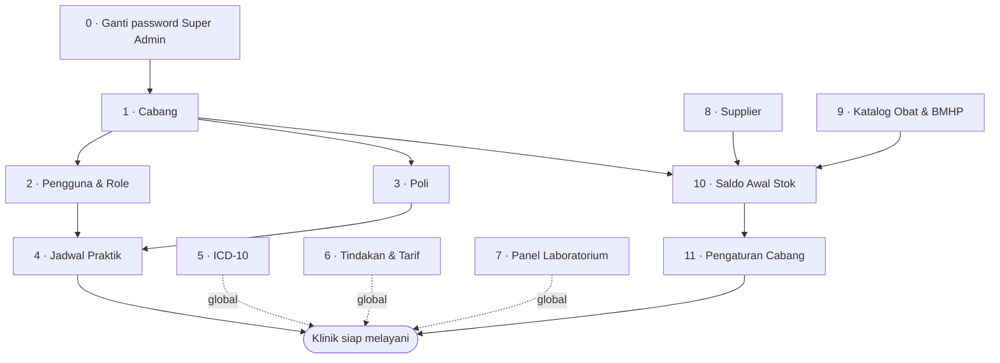

# Urutan Penginputan Master Data

Panduan ini dipakai setelah `node scripts/kosongkan.mjs --ya`, saat basis data
hanya berisi kerangka RBAC dan satu akun Super Admin.

**Urutannya bukan sekadar saran rapi.** Sebagian besar langkah benar-benar
tidak bisa dikerjakan sebelum langkah sebelumnya ada: form-nya menolak, atau
daftar pilihannya kosong. Beberapa langkah lain *bisa* dikerjakan terbalik
tetapi meninggalkan kerusakan yang baru terlihat berminggu-minggu kemudian —
langkah-langkah itu ditandai khusus di bawah.

---

## Peta ketergantungan



## Global vs. per-cabang

Salah paham di sini menyebabkan pekerjaan diulang tanpa perlu, atau justru
cabang kedua berjalan dengan data yang belum ada.

| Sekali saja untuk semua cabang | Diulang untuk **setiap** cabang |
|---|---|
| ICD-10 | Poli |
| Tindakan & tarif dasar | Jadwal praktik dokter |
| Panel & parameter laboratorium | Saldo awal stok |
| Katalog obat & BMHP, kategori | Pengaturan (pembulatan, jasa racik, dll.) |
| Supplier | Override tarif tindakan (opsional) |

Katalog obat bersifat global, tetapi **stoknya per cabang**. Satu item yang
sama punya saldo, batch, dan tanggal kadaluarsa sendiri-sendiri di tiap cabang.

---

## Langkah demi langkah

### 0 · Ganti password Super Admin — *sebelum menyentuh apa pun*

```bash
node scripts/rotasi-kredensial.mjs --semua
```

Hash contoh dari `db/seed.sql` ikut ke repositori. Selama belum diganti, akun
itu bukan milik Anda sendiri. Kerjakan ini lebih dulu supaya data asli yang
masuk berikutnya tidak pernah berada di bawah kredensial publik.

---

### 1 · Cabang — *Super Admin → Cabang*

Semua data lain terikat ke cabang, jadi ini benar-benar harus pertama.

Isi lengkap sejak awal, terutama **nama legal, nomor izin klinik, dan alamat**.
Ketiganya muncul sebagai kop surat pada surat keterangan, hasil lab, dan
rujukan. Mengisinya belakangan tidak memperbaiki dokumen yang sudah
telanjur dicetak dan diserahkan ke pasien.

Menyimpan cabang baru otomatis membuat penomoran dokumennya (RM, kunjungan,
resep, invoice, lab, surat, penerimaan, opname) dan pengaturan bawaannya.

---

### 2 · Pengguna & Role — *Super Admin → Pengguna & Role*

Butuh cabang (langkah 1). Urutan di dalamnya:

1. **Admin Cabang** lebih dulu — ia yang mengerjakan langkah 3, 4, dan 11.
2. **Dokter** — lengkapi **No. SIP dan STR**. Keduanya dicetak pada surat
   keterangan dan e-resep; resep tanpa SIP tidak sah secara administratif.
3. Perawat, Petugas Lab, Farmasi, Kasir.

**Dokter yang praktik di lebih dari satu cabang:** centang cabang tambahannya
pada form pengguna. Daftar penugasan ikut di dalam token sesi yang
ditandatangani, jadi **perubahan penugasan baru berlaku setelah yang
bersangkutan login ulang** (paling lama 10 jam). Ini konsekuensi dari
pemeriksaan hak akses di Edge runtime yang tidak bisa mengakses MySQL — bukan
sesuatu yang bisa dipercepat dari layar admin.

---

### 3 · Poli — *Admin Cabang → (per cabang)*

Butuh cabang. Dibutuhkan oleh jadwal praktik **dan** pendaftaran pasien:
tanpa poli, pasien tidak bisa didaftarkan sama sekali.

---

### 4 · Jadwal Praktik — *Admin Cabang → Jadwal Praktik*

Butuh dokter (2) dan poli (3).

Pendaftaran memilih dokter berdasarkan jadwal hari itu. Tanpa jadwal, layar
pendaftaran tidak menawarkan dokter mana pun dan antrean tidak bisa dibuat —
gejalanya terlihat seperti kerusakan, padahal datanya yang belum ada.

---

### 5 · ICD-10 — *Super Admin → ICD-10 → Impor Massal*

Global; cukup sekali. Format: `kode, nama Indonesia, nama Inggris, kategori`.

Daftar Kemenkes berjumlah puluhan ribu kode. Impor apa adanya — dokter mencari
lewat pencarian, bukan menelusuri daftar, jadi ukuran daftar tidak menghambat.
Jangan menyeleksi "yang sering dipakai saja": diagnosis yang tidak ada kodenya
akan memaksa dokter memilih kode yang mirip tetapi salah, dan itu terbawa
sampai ke pelaporan.

---

### 6 · Tindakan & Tarif — *Super Admin → Poli & Tindakan → Impor Massal*

Global. Format: `kode, nama, kategori, tarif, ICD-9-CM`.

Tarif di sini adalah **tarif dasar**. Bila sebuah cabang menetapkan tarif
berbeda, isi override-nya per cabang; tanpa baris override, cabang memakai
tarif dasar.

---

### 7 · Panel & Parameter Laboratorium — *Super Admin → Panel Laboratorium*

Global, dan **manual dengan sengaja** — tidak ada impor massal.

Setiap parameter butuh **rentang rujukan** (dan rentang kritis bila ada).
Penanda nilai kritis otomatis pada hasil lab bekerja dari angka-angka ini.
Parameter yang rentangnya dibiarkan kosong tidak akan pernah menandai apa pun,
dan hasil yang berbahaya lewat begitu saja tanpa peringatan. Jumlah panel di
klinik pratama sedikit; kecermatan di sini lebih penting daripada kecepatan.

---

### 8 · Supplier — *Farmasi → Penerimaan*

Isi sebelum penerimaan pertama supaya asal barang tercatat. Supplier
**opsional** pada form penerimaan, jadi saldo awal (langkah 10) tidak
memerlukan supplier boneka.

---

### 9 · Katalog Obat & BMHP — *Super Admin → Katalog → Impor Massal*

Global. Format:

```
kode, tipe, nama, satuan, HPP, harga jual, stok min, bentuk sediaan,
boleh diracik (1/0), butuh resep (1/0), kategori (opsional)
```

Catatan yang menentukan:

- **`tipe`** — `obat`, `bmhp`, atau `alkes`. Perawat hanya bisa memilih `bmhp`
  pada pengkajian; obat yang salah tipe tidak akan muncul di sana.
- **`boleh diracik`** — hanya item bertanda ini yang bisa dipakai sebagai bahan
  racikan oleh dokter.
- **`harga jual` tidak boleh di bawah `HPP`** — baris seperti itu ditolak,
  sama seperti pada form satuan. Impor bukan jalan pintas untuk melanggarnya.
- **`kategori`** dibuat otomatis bila belum ada. Isi kolom ini: laporan farmasi
  mengelompokkan berdasarkan kategori, dan katalog ribuan baris tanpa kategori
  praktis tidak bisa diperbaiki belakangan satu per satu.

Baris rusak **dilewati dan dilaporkan per baris beserta alasannya**, bukan
membatalkan seluruh impor. Perbaiki baris yang dilaporkan lalu impor ulang —
impor ulang memperbarui berdasarkan `kode`, tidak menggandakan.

---

### 10 · Saldo Awal Stok — *Farmasi → Penerimaan* — **jangan lewat basis data**

Butuh cabang (1) dan katalog (9). Diulang untuk setiap cabang.

Masukkan stok yang sudah ada di gudang **sebagai Penerimaan biasa**, dengan
nomor batch dan tanggal kadaluarsa sebenarnya. Supplier boleh dikosongkan dan
catatan diisi "Saldo awal".

Menyuntikkan saldo langsung ke tabel `item_stocks` dengan `UPDATE` memang
membuat angka di layar terlihat benar, dan justru itu bahayanya:

1. **Kartu stok jadi bohong.** Saldo gudang wajib selalu sama dengan jumlah
   seluruh pergerakan (`stock_movements`). Saldo yang masuk tanpa pergerakan
   memutus persamaan itu, dan alat rekonsiliasi — satu-satunya cara menemukan
   kebocoran stok — kehilangan gunanya. Ini bukan kekhawatiran teoretis:
   `db/seed.sql` melakukan persis kesalahan ini dan tidak ada yang menyadarinya
   sampai uji rekonsiliasi ditulis.
2. **FEFO kehilangan pegangan.** Stok tanpa batch tidak punya tanggal
   kadaluarsa, jadi tidak pernah muncul di Monitoring Kadaluarsa dan tidak
   pernah terkunci dari penyerahan ke pasien. Obat kadaluarsa akan diserahkan
   tanpa satu pun peringatan.

Setelah selesai, buktikan:

```bash
node uji/jalankan.mjs uji-rekonsiliasi.ts
```

---

### 11 · Pengaturan Cabang — *Admin Cabang → Pengaturan*

Nilai bawaan sengaja dibuat **nol** supaya tidak ada biaya yang diam-diam
ditambahkan ke tagihan pasien tanpa pernah diputuskan klinik. Tetapkan
sekarang untuk tiap cabang:

| Pengaturan | Akibat bila dibiarkan nol/bawaan |
|---|---|
| `billing.pembulatan` | Tagihan tidak dibulatkan — kasir kesulitan kembalian |
| `billing.biaya_admin` | Tidak ada biaya administrasi per kunjungan |
| `racikan.jasa_racik_default` | **Racikan tidak menagih jasa racik sama sekali** |
| `stok.peringatan_kadaluarsa_hari` | 90 hari (aman, ubah sesuai kebijakan) |
| `cetak.printer_thermal` | 80 mm — ubah ke 58 bila printernya kecil |

---

## Daftar periksa sebelum melayani pasien pertama

| # | Periksa | Cara |
|---|---|---|
| 1 | Password contoh sudah diganti | Coba login dengan password lama — harus gagal |
| 2 | Kop surat benar | Cetak satu surat keterangan uji, lihat nama legal & no. izin |
| 3 | Setiap dokter punya SIP | Pengguna → filter Dokter |
| 4 | Jadwal hari ini ada | Pendaftaran → daftarkan pasien uji, dokter harus muncul |
| 5 | Saldo stok = kartu stok | `node uji/jalankan.mjs uji-rekonsiliasi.ts` |
| 6 | Parameter lab punya rentang rujukan | Panel Laboratorium → periksa satu per satu |
| 7 | Backup berjalan & terverifikasi | `node scripts/backup.mjs` lalu `--verifikasi` |

Setelah daftar ini lolos, hapus pasien uji yang dibuat pada langkah 4 —
atau kosongkan ulang dan isi lagi, karena sekarang prosesnya sudah terbukti:

```bash
node scripts/kosongkan.mjs --ya --hanya-klinis
```

`--hanya-klinis` membuang pasien, kunjungan, resep, tagihan, dan stok
percobaan, sementara cabang, akun staf, jadwal, poli, ICD-10, tindakan, panel
lab, dan katalog tetap utuh. Penomoran dokumen kembali ke 1 sehingga No. RM
pasien asli pertama tidak melanjutkan nomor pasien uji.

Stok dikembalikan ke **nol**, bukan dikurangi sebanyak yang terpakai saat uji.
Saldo gudang wajib selalu sama dengan jumlah seluruh pergerakannya; menghapus
sebagian pergerakan sambil menyisakan saldo justru memutus persamaan itu.
Masukkan ulang saldo awal lewat Penerimaan (langkah 10).
